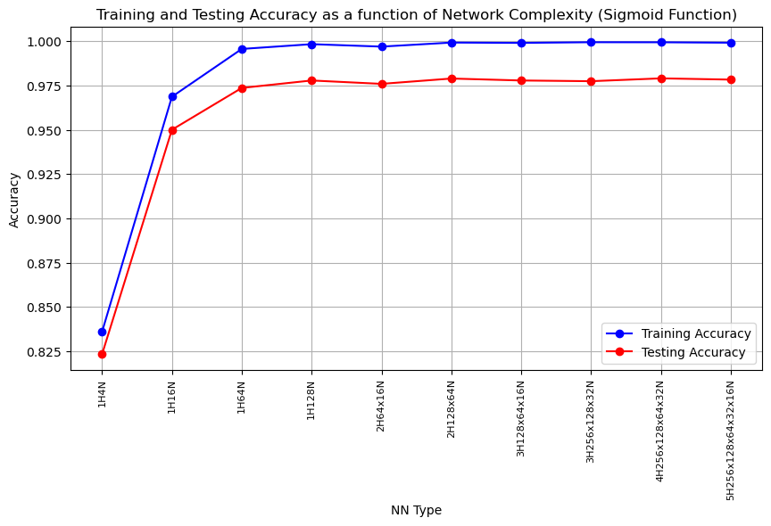
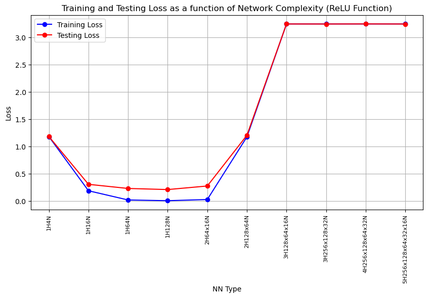

# Neural Network from Scratch

## Overview
This project involves building a dynamic neural network from scratch using the numpy library, applied on the MNIST dataset. The neural network is designed as a dynamic class, featuring various activation functions and capable of handling different network architectures. It's an ideal resource for learning the fundamentals of neural networks.

## Features
- **Dynamic Architecture:** Create neural networks with customizable layers and neurons.
- **Activation Functions:** ReLU and Sigmoid functions for activation, including their derivatives for backpropagation.
- **Softmax Output Layer:** For multi-class classification.
- **Batch Learning:** Supports mini-batch and stochastic gradient descent (SGD) updates.
- **Learning Rate Adjustment:** Update learning rate using decay parameters.
- **Epoch-Based Training:** Set a specific number of epochs for training.
- **Performance Metrics:** Loss and accuracy calculations included.

## Dataset
- Uses the MNIST dataset, which comprises handwritten digit images.

## Requirements
- Python 3.x
- Numpy

## Installation

pip install numpy


## Usage
To use this neural network implementation:
1. Clone the repository and navigate to the project directory.
2. Import the neural network class from the provided script.
3. Load the MNIST dataset.
4. Create an instance of the neural network with desired parameters.
5. Train the model using the `train` method with specified learning parameters.
6. Evaluate the model's performance using the `test` method.

## Example
Here's an example of how to use the neural network:

```python
from Task1 import MyNeuralNetwork

# Initialize the neural network
nn1 = MyNeuralNetwork(input_size=784, hidden_sizes=[4], output_size=10, activation_function='sigmoid', dropout=0.0)

# Train the neural network
losses, accuracies = nn1.train(X_train, y_train, learning_rate=1, epochs=25, batch_size=64, decay_rate=0.1, decay_step=10)

# Append last entry of train loss to dictionary for plotting
last_epoch_loss = losses[-1]
training_loss.append(last_epoch_loss)

# Test the neural network
loss, acc = nn1.test(X_test, y_test)
print(f'Test Loss: {loss}, Test Accuracy: {acc}')






